# Manutenção Residencial

Sistema de intermediação de serviços de manutenção residencial: conecta **clientes** que precisam de
um serviço a **profissionais** que o executam, passando por solicitação, orçamento, agendamento,
execução, pagamento e avaliação.

O modelo aplica os nove padrões **GRASP** e, junto com eles, os cinco princípios **SOLID**. O diagrama
de classes abaixo corresponde exatamente às classes que estão em `src/`.

## Diagrama de classes

```mermaid
classDiagram
    class Usuario {
        <<abstract>>
        #idUsuario int
        #nome String
        #email String
        #senha String
        #telefone String
        #fotoPerfil String
        +cadastrar() boolean
        +login(email, senha) boolean
        +logout() void
        +recuperarSenha(email) void
        +editarDados() void
        +perfil() String
    }
    class Cliente {
        +perfil() String
        +solicitarServico(categoria) SolicitacaoServico
        +avaliarProfissional(execucao, nota, comentario) Avaliacao
    }
    class Profissional {
        -descricao String
        -regiaoAtendimento String
        -mediaAvaliacao double
        -especialidades List~Especialidade~
        -disponibilidades List~Disponibilidade~
        -avaliacoes List~Avaliacao~
        +perfil() String
        +getMediaAvaliacao() double
        +receberAvaliacao(nota, comentario) void
        +adicionarEspecialidade(categoria, experiencia) void
        +definirDisponibilidade(disponibilidade) void
        +enviarOrcamento(solicitacao, valor) Orcamento
    }
    class Administrador {
        +perfil() String
    }
    class Avaliavel {
        <<interface>>
        +receberAvaliacao(nota, comentario) void
        +getMediaAvaliacao() double
    }
    class Endereco {
        -idEndereco int
        -idUsuario int
        -logradouro String
        -cidade String
        -estado String
        -cep String
        +cadastrarEndereco() void
        +editarEndereco() void
    }
    class Especialidade {
        -idEspecialidade int
        -profissional Profissional
        -idCategoria int
        -experiencia String
    }
    class Disponibilidade {
        -idDisponibilidade int
        -idProfissional int
        -diaSemana String
        -horaInicio String
        -horaFim String
        +verificarConflito(dataHora) boolean
    }
    class Categoria {
        -idCategoria int
        -nome String
        -especialidades List~Especialidade~
        +adicionarEspecialidade(especialidade) void
        +listarProfissionais() List~Profissional~
    }
    class SolicitacaoServico {
        -idSolicitacao int
        -idCliente int
        -idCategoria int
        -idEndereco int
        -descricao String
        -fotos List~String~
        -videos List~String~
        -urgencia String
        -periodoPreferido String
        -status String
        +cancelar() void
        +consultarStatus() String
        +atualizarStatus(status) void
    }
    class Orcamento {
        -idOrcamento int
        -idSolicitacao int
        -idProfissional int
        -valor double
        -materiaisInclusos String
        -prazoEstimado String
        -status String
        +aceitar() void
        +recusar() void
        +solicitarAlteracao() void
        +consultarStatus() String
    }
    class Agendamento {
        -idAgendamento int
        -idOrcamento int
        -dataHora String
        -status String
        +confirmar() void
        +reagendar(novaData) void
        +cancelar() void
        +enviarLembrete() void
        +iniciarExecucao() ExecucaoServico
    }
    class ExecucaoServico {
        -idExecucao int
        -idAgendamento int
        -dataInicio String
        -dataFim String
        -observacoes String
        -fotosServico List~String~
        -status String
        +iniciarServico() void
        +atualizarStatus(status) void
        +finalizarServico() void
        +confirmarConclusao() void
        +gerarPagamento(valorFinal, formaPagamento) Pagamento
    }
    class Pagamento {
        -idPagamento int
        -idExecucao int
        -valorFinal double
        -formaPagamento String
        -statusPagamento String
        -dataPagamento String
        -gateway GatewayPagamento
        +registrarPagamento() boolean
        +consultarStatus() String
    }
    class GatewayPagamento {
        <<interface>>
        +processarPagamento(valor, forma) boolean
    }
    class GatewayPagamentoExterno {
        -provedor String
        +processarPagamento(valor, forma) boolean
    }
    class Avaliacao {
        -idAvaliacao int
        -idExecucao int
        -idCliente int
        -idProfissional int
        -nota int
        -comentario String
        +denunciar(motivo) Denuncia
    }
    class Denuncia {
        -idDenuncia int
        -idAvaliacao int
        -idUsuario int
        -motivo String
        -status String
        -data String
        +analisar() void
        +arquivar() void
        +consultarStatus() String
    }
    class GerenciadorDenuncia {
        -denuncias List~Denuncia~
        +registrar(denuncia) void
        +analisarPendentes() List~Denuncia~
        +arquivar(idDenuncia) void
    }
    class Notificacao {
        -idNotificacao int
        -idUsuario int
        -tipo String
        -mensagem String
        -lida boolean
        -data String
        -canal CanalNotificacao
        +enviar(destinatario) void
        +marcarComoLida() void
    }
    class CanalNotificacao {
        <<interface>>
        +enviar(mensagem, destinatario) void
    }
    class NotificadorEmail {
        +enviar(mensagem, destinatario) void
    }
    class NotificadorSms {
        +enviar(mensagem, destinatario) void
    }
    class BuscaProfissionais {
        -termoBusca String
        -base List~Profissional~
        +cadastrarNaBase(profissional) void
        +buscar(criterios) List~Profissional~
    }
    class FiltroBusca {
        <<interface>>
        +aplicar(profissionais) List~Profissional~
    }
    class FiltroCategoria {
        -categoria Categoria
        +aplicar(profissionais) List~Profissional~
    }
    class FiltroRegiao {
        -regiao String
        +aplicar(profissionais) List~Profissional~
    }
    class PainelAdministrativo {
        -idAdmin int
        -idUsuario int
        +gerenciarClientes() void
        +gerenciarProfissionais() void
        +gerenciarCategorias() void
        +gerenciarServicos() void
        +bloquearUsuario(idUsuario) void
        +gerenciarAvaliacoes() void
        +verEstatisticas() void
    }
    class GerenciamentoUsuarios {
        <<interface>>
        +gerenciarClientes() void
        +gerenciarProfissionais() void
        +bloquearUsuario(idUsuario) void
    }
    class GerenciamentoCatalogo {
        <<interface>>
        +gerenciarCategorias() void
        +gerenciarServicos() void
    }
    class GerenciamentoModeracao {
        <<interface>>
        +gerenciarAvaliacoes() void
    }
    class Estatisticas {
        <<interface>>
        +verEstatisticas() void
    }
    class Historico {
        -idHistorico int
        -idUsuario int
        -repositorioSolicitacao Repositorio~SolicitacaoServico~
        -orcamentos List~Orcamento~
        -agendamentos List~Agendamento~
        -execucoes List~ExecucaoServico~
        -pagamentos List~Pagamento~
        -avaliacoes List~Avaliacao~
        +registrar(orcamento) void
        +registrar(agendamento) void
        +registrar(execucao) void
        +registrar(pagamento) void
        +registrar(avaliacao) void
        +listarSolicitacoes(idUsuario) List~SolicitacaoServico~
        +listarOrcamentos(idUsuario) List~Orcamento~
        +listarAgendamentos(idUsuario) List~Agendamento~
        +listarExecucoes(idUsuario) List~ExecucaoServico~
        +listarPagamentos(idUsuario) List~Pagamento~
        +listarAvaliacoes(idUsuario) List~Avaliacao~
    }
    class Repositorio~T~ {
        <<interface>>
        +salvar(entidade) void
        +listarPorUsuario(idUsuario) List~T~
    }
    class RepositorioSolicitacao {
        -solicitacoes List~SolicitacaoServico~
        +salvar(entidade) void
        +listarPorUsuario(idUsuario) List~SolicitacaoServico~
    }

    Usuario <|-- Cliente
    Usuario <|-- Profissional
    Avaliavel <|.. Profissional
    Usuario <|-- Administrador
    GatewayPagamento <|.. GatewayPagamentoExterno
    CanalNotificacao <|.. NotificadorEmail
    CanalNotificacao <|.. NotificadorSms
    FiltroBusca <|.. FiltroCategoria
    FiltroBusca <|.. FiltroRegiao
    GerenciamentoUsuarios <|.. PainelAdministrativo
    GerenciamentoCatalogo <|.. PainelAdministrativo
    GerenciamentoModeracao <|.. PainelAdministrativo
    Estatisticas <|.. PainelAdministrativo
    Repositorio <|.. RepositorioSolicitacao
    Profissional "1" --> "*" Especialidade : especialidades
    Profissional "1" --> "*" Disponibilidade : disponibilidades
    Profissional "1" --> "*" Avaliacao : avaliacoes
    Categoria "1" --> "*" Especialidade : especialidades
    GerenciadorDenuncia "1" --> "*" Denuncia : denuncias
    BuscaProfissionais "1" --> "*" Profissional : base
    FiltroCategoria "1" --> "1" Categoria : categoria
    Historico "1" --> "*" Orcamento : orcamentos
    Historico "1" --> "*" Agendamento : agendamentos
    Historico "1" --> "*" ExecucaoServico : execucoes
    Historico "1" --> "*" Pagamento : pagamentos
    Historico "1" --> "*" Avaliacao : avaliacoes
    RepositorioSolicitacao "1" --> "*" SolicitacaoServico : solicitacoes
    Usuario "1" --> "*" Endereco
    Cliente "1" --> "*" SolicitacaoServico
    Categoria "1" --> "*" SolicitacaoServico
    Endereco "1" --> "*" SolicitacaoServico
    SolicitacaoServico "1" --> "*" Orcamento
    Profissional "1" --> "*" Orcamento
    Orcamento "1" --> "0..1" Agendamento
    Agendamento "1" --> "1" ExecucaoServico
    ExecucaoServico "1" --> "1" Pagamento
    ExecucaoServico "1" --> "0..1" Avaliacao
    Cliente "1" --> "*" Avaliacao
    Avaliacao "1" --> "*" Denuncia
    Usuario "1" --> "*" Denuncia
    Usuario "1" --> "*" Notificacao
    Administrador "1" --> "1" PainelAdministrativo
    Usuario "1" --> "*" Historico
    Pagamento ..> GatewayPagamento : depende de
    Notificacao ..> CanalNotificacao : depende de
    Historico ..> Repositorio : depende de
```



Getters e setters simples foram omitidos do diagrama, como é usual em diagrama de classes. Todo o
restante — atributos, métodos, heranças, associações e dependências — está igual ao código.

## Padrões GRASP aplicados

| Classe | Padrão GRASP | Onde aparece |
| --- | --- | --- |
| `Usuario` | Polymorphism (base) | Classe abstrata que define `perfil()` e deixa cada subtipo responder de forma diferente. |
| `Cliente` | Creator | Cria `SolicitacaoServico` e `Avaliacao`, porque é quem tem os dados necessários para inicializá-las. |
| `Profissional` | Creator, Information Expert | Cria `Orcamento` e `Especialidade`; guarda as próprias avaliações, então é ele quem calcula a média. |
| `Administrador` | Polymorphism | Sobrescreve `perfil()` mantendo o contrato de `Usuario`. |
| `Avaliavel` | Protected Variations | Interface que protege o restante do sistema de mudanças em quem pode ser avaliado. |
| `Endereco` | Information Expert | Guarda e valida os próprios dados de endereço. |
| `Especialidade` | Information Expert | Sabe informar a experiência do profissional naquela categoria. |
| `Disponibilidade` | Information Expert | Tem os horários, então é ela quem verifica conflito de agenda. |
| `Categoria` | Information Expert | Conhece as especialidades vinculadas e deriva delas a lista de profissionais. |
| `SolicitacaoServico` | Information Expert | Concentra os dados da solicitação e controla o próprio status. |
| `Orcamento` | Information Expert | Guarda valor, prazo e status, e responde pelas transições de aceite ou recusa. |
| `Agendamento` | Creator, Information Expert | Cria a `ExecucaoServico` correspondente e mantém data, hora e status. |
| `ExecucaoServico` | Creator, Information Expert | Cria o `Pagamento` da execução e controla o andamento do serviço. |
| `Pagamento` | Low Coupling | Depende da interface `GatewayPagamento`, não de um provedor concreto. |
| `GatewayPagamento` | Protected Variations, Indirection | Intermediário entre o sistema e o provedor externo: trocar de provedor não afeta `Pagamento`. |
| `GatewayPagamentoExterno` | Polymorphism | Implementação concreta do gateway de pagamento. |
| `Avaliacao` | Information Expert, Creator | Guarda nota e comentário e cria a `Denuncia` quando acionada. |
| `Denuncia` | Information Expert | Mantém motivo e status da denúncia. |
| `GerenciadorDenuncia` | High Cohesion, Pure Fabrication | Classe com uma única responsabilidade: tratar denúncias. Não é conceito do domínio, foi criada para não sobrecarregar o `PainelAdministrativo`. |
| `Notificacao` | Low Coupling | Delega o envio para `CanalNotificacao` em vez de conhecer o meio de envio. |
| `CanalNotificacao` | Protected Variations | Isola o sistema da forma de envio (e-mail, SMS, push). |
| `NotificadorEmail` | Polymorphism | Implementação concreta do canal de notificação (e-mail). |
| `NotificadorSms` | Polymorphism | Segunda implementação do canal de notificação (SMS) — mostra a extensão sem alterar `Notificacao`. |
| `BuscaProfissionais` | Controller, Pure Fabrication | Coordena a operação de busca sem ser um conceito do domínio. |
| `FiltroBusca` | Protected Variations | Permite novos critérios de busca sem alterar `BuscaProfissionais`. |
| `FiltroCategoria` | Polymorphism | Implementação concreta do filtro (por categoria). |
| `FiltroRegiao` | Polymorphism | Segunda implementação do filtro (por região) — mostra a extensão sem alterar `BuscaProfissionais`. |
| `PainelAdministrativo` | Controller | Recebe e encaminha as operações administrativas do sistema. |
| `GerenciamentoUsuarios` | Protected Variations | Interface segregada só com as operações sobre usuários. |
| `GerenciamentoCatalogo` | Protected Variations | Interface segregada só com as operações sobre categorias e serviços. |
| `GerenciamentoModeracao` | Protected Variations | Interface segregada só com a operação de moderação de avaliações. |
| `Estatisticas` | Protected Variations | Interface segregada só com a consulta de estatísticas. |
| `Historico` | Pure Fabrication | Classe artificial criada só para consultar registros, mantendo as entidades coesas. |
| `Repositorio` | Protected Variations, Indirection | Abstrai o acesso aos dados: `Historico` não conhece onde nem como os registros são guardados. |
| `RepositorioSolicitacao` | Polymorphism | Implementação concreta do repositório de solicitações. |

## Princípios SOLID aplicados

**S — Responsabilidade Única**

| Onde | Por quê |
| --- | --- |
| `SolicitacaoServico, Orcamento, Agendamento, ExecucaoServico, Pagamento, Avaliacao, Denuncia` | cada uma guarda só os próprios dados e o próprio ciclo de status — não decide nada sobre outra entidade. |
| `GerenciadorDenuncia` | responsabilidade única de tratar denúncias, separada do `PainelAdministrativo`. |

**O — Aberto/Fechado**

| Onde | Por quê |
| --- | --- |
| `FiltroBusca → FiltroCategoria e FiltroRegiao` | dá pra adicionar um critério de busca novo sem alterar `BuscaProfissionais`. |
| `CanalNotificacao → NotificadorEmail e NotificadorSms` | dá pra adicionar um canal novo sem alterar `Notificacao`. |

**L — Substituição de Liskov**

| Onde | Por quê |
| --- | --- |
| `Usuario → Cliente, Profissional, Administrador` | os três substituem `Usuario` em qualquer lugar do código sem quebrar o contrato de `perfil()`. |

**I — Segregação de Interface**

| Onde | Por quê |
| --- | --- |
| `PainelAdministrativo implementa GerenciamentoUsuarios, GerenciamentoCatalogo, GerenciamentoModeracao e Estatisticas` | em vez de uma interface única com todos os métodos, cada responsabilidade tem sua própria interface — quem depender só de estatísticas, por exemplo, não é forçado a conhecer os métodos de moderação. |

**D — Inversão de Dependência**

| Onde | Por quê |
| --- | --- |
| `Pagamento depende de GatewayPagamento` | não de `GatewayPagamentoExterno` diretamente. |
| `Notificacao depende de CanalNotificacao` | não de `NotificadorEmail`/`NotificadorSms` diretamente. |
| `Historico depende de Repositorio<T>` | não de `RepositorioSolicitacao` diretamente. |

## Como executar

Pelo terminal, dentro da pasta do projeto:

```bash
javac -d out src/*.java
java -cp out Main
```

Pelo VS Code: abrir a pasta do projeto, instalar o *Extension Pack for Java* e executar `Main.java`.

A classe `Main` não faz parte do modelo: ela existe apenas para demonstrar o sistema funcionando,
percorrendo o fluxo completo de cadastro, busca (por categoria e por região), solicitação, orçamento,
agendamento, execução, pagamento, avaliação, denúncia e notificação (e-mail e SMS).

## Estrutura

```
ManutencaoResidencial/
├── README.md
└── src/
    ├── Main.java
    ├── Usuario.java, Cliente.java, Profissional.java, Administrador.java
    ├── SolicitacaoServico.java, Orcamento.java, Agendamento.java, ExecucaoServico.java
    ├── Pagamento.java, Avaliacao.java, Denuncia.java, Notificacao.java
    └── demais classes e interfaces do modelo
```
