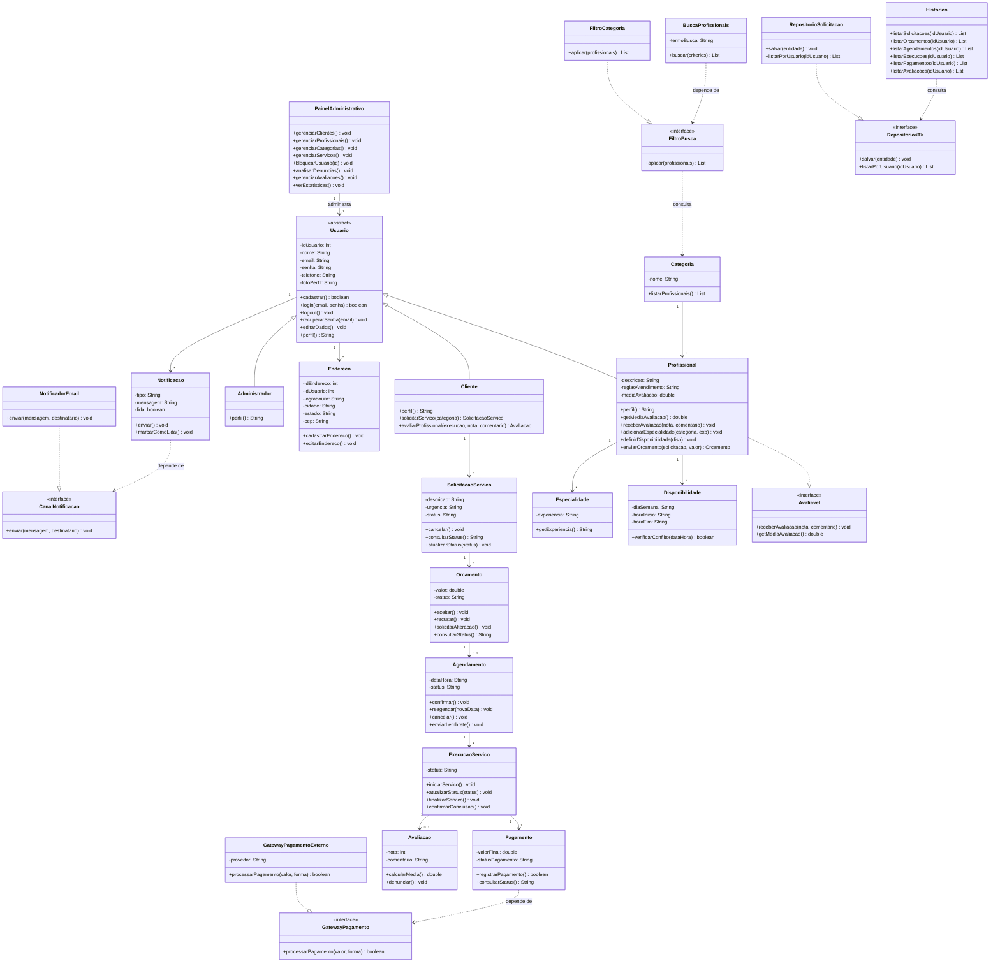
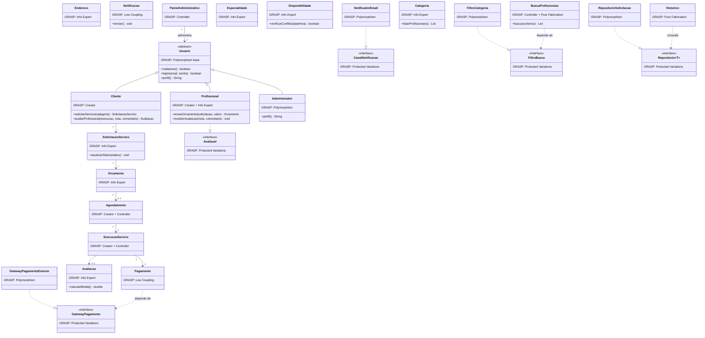

# Manutenção Residencial — Diagramas e Código (GRASP e SOLID)

Sistema de intermediação de serviços de manutenção residencial (conecta **Clientes** que precisam de
um serviço a **Profissionais** que o executam), modelado em três etapas: diagrama original, aplicação
dos princípios **GRASP** e aplicação dos princípios **SOLID**.

## 1. Diagrama de classes — antes (original)

Versão inicial do domínio, sem anotação de padrões de design.



## 2. Diagrama de classes — princípios GRASP aplicados

Cada classe traz o padrão GRASP identificado (Information Expert, Creator, Controller, Low Coupling,
High Cohesion, Polymorphism, Pure Fabrication, Indirection, Protected Variations).



## 3. Diagrama de classes — princípios SOLID aplicados

A mesma modelagem, reestruturada para deixar explícitos os 5 princípios SOLID. Principais mudanças
em relação à versão GRASP:

- **SRP** — entidades (`SolicitacaoServico`, `Orcamento`, `Avaliacao`, `Notificacao`) passam a guardar
  só dados; a regra de negócio migra para *services* dedicados (`SolicitacaoServicoService`,
  `OrcamentoService`, `AvaliacaoService`, `NotificacaoService`).
- **OCP** — `FiltroBusca`, `CanalNotificacao` e `GatewayPagamento` ganham uma segunda implementação
  cada (`FiltroRegiao`, `NotificadorSms`) mostrando que dá pra estender sem alterar código existente.
- **LSP** — `Cliente`, `Profissional` e `Administrador` continuam substituindo `Usuario` sem quebrar
  o contrato de `perfil()`.
- **ISP** — o `PainelAdministrativo`, que no diagrama original tinha 8 métodos numa interface só, é
  dividido em `GerenciamentoUsuarios`, `GerenciamentoCatalogo`, `GerenciamentoModeracao` e
  `Estatisticas`.
- **DIP** — `Pagamento` e `Historico` recebem a abstração (`GatewayPagamento`, `Repositorio`) via
  construtor, em vez de instanciar a implementação concreta.

```mermaid
classDiagram
    class Usuario {
        <<abstract>>
        SOLID: LSP
        +login(email, senha) boolean
        +perfil() String
    }
    class Cliente {
        SOLID: LSP
        +solicitarServico(categoria, service) SolicitacaoServico
    }
    class Profissional {
        SOLID: SRP
    }
    class Administrador {
        SOLID: LSP
    }
    class SolicitacaoServico {
        SOLID: SRP
        (só dados e status)
    }
    class SolicitacaoServicoService {
        SOLID: SRP + DIP
        +criar(idCliente, idCategoria) SolicitacaoServico
    }
    class Orcamento {
        SOLID: SRP
    }
    class OrcamentoService {
        SOLID: SRP
        +enviarOrcamento(solicitacao, profissional, valor) Orcamento
    }
    class Avaliacao {
        SOLID: SRP
    }
    class AvaliacaoService {
        SOLID: SRP
        +calcularMedia(idProfissional) double
    }
    class Notificacao {
        SOLID: SRP
    }
    class NotificacaoService {
        SOLID: SRP + DIP
        +enviar(notificacao, destinatario) void
    }
    class CanalNotificacao {
        <<interface>>
        SOLID: OCP + DIP
    }
    class NotificadorEmail {
        SOLID: OCP
    }
    class NotificadorSms {
        SOLID: OCP extensao
    }
    class FiltroBusca {
        <<interface>>
        SOLID: OCP
    }
    class FiltroCategoria {
        SOLID: OCP
    }
    class FiltroRegiao {
        SOLID: OCP extensao
    }
    class BuscaProfissionaisService {
        SOLID: DIP
        +buscar(base, criterio) List
    }
    class GerenciamentoUsuarios {
        <<interface>>
        SOLID: ISP
    }
    class GerenciamentoCatalogo {
        <<interface>>
        SOLID: ISP
    }
    class GerenciamentoModeracao {
        <<interface>>
        SOLID: ISP
    }
    class Estatisticas {
        <<interface>>
        SOLID: ISP
    }
    class PainelAdministrativo {
        SOLID: ISP
    }
    class GatewayPagamento {
        <<interface>>
        SOLID: OCP + DIP
    }
    class GatewayPagamentoExterno {
        SOLID: OCP
    }
    class Pagamento {
        SOLID: DIP
        +registrarPagamento(forma) boolean
    }
    class Repositorio~T~ {
        <<interface>>
        SOLID: DIP
    }
    class RepositorioSolicitacao {
        SOLID: OCP
    }
    class Historico {
        SOLID: SRP + DIP
    }

    Usuario <|-- Cliente
    Usuario <|-- Profissional
    Usuario <|-- Administrador
    NotificadorEmail ..|> CanalNotificacao
    NotificadorSms ..|> CanalNotificacao
    FiltroCategoria ..|> FiltroBusca
    FiltroRegiao ..|> FiltroBusca
    GatewayPagamentoExterno ..|> GatewayPagamento
    RepositorioSolicitacao ..|> Repositorio
    PainelAdministrativo ..|> GerenciamentoUsuarios
    PainelAdministrativo ..|> GerenciamentoCatalogo
    PainelAdministrativo ..|> GerenciamentoModeracao
    PainelAdministrativo ..|> Estatisticas
    Cliente ..> SolicitacaoServicoService : usa
    SolicitacaoServicoService ..> Repositorio : depende de
    NotificacaoService ..> CanalNotificacao : depende de
    BuscaProfissionaisService ..> FiltroBusca : depende de
    Pagamento ..> GatewayPagamento : depende de
    Historico ..> Repositorio : depende de
```

## Estrutura do repositório

```
ManutencaoResidencial/
├── README.md                 <- este arquivo (diagramas + explicação)
└── src/main/java/com/manutencaoresidencial/
    ├── grasp/                <- código Java da versão com princípios GRASP
    └── solid/                <- código Java da versão com princípios SOLID
```

## Sobre o projeto

Trabalho acadêmico de modelagem de sistema — domínio de intermediação de serviços de manutenção
residencial (conecta clientes que precisam de um reparo/serviço a profissionais disponíveis na
região, com fluxo de solicitação → orçamento → agendamento → execução → pagamento → avaliação).
